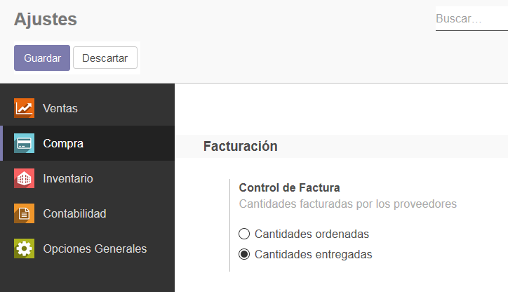

###################################################################################################
Facturas de compra
###################################################################################################

.. image:: media/estados-factura-compra.png
   :align: center
   :scale: 75 %

*************************************************
Estados de facturación del pedido de compra
*************************************************

En este diagrama se muestran los estados por los que atraviesa un pedido respecto a su facturación:

.. image:: media/estados-facturacion-pedido-compra.png
   :align: center
   :scale: 75 %

Consultemos el estado de los pedidos que tenemos actualmente:

.. image:: media/facturas-1.png
   :align: center
   :scale: 75 %

Si consultamos la vista individual de cada uno, podremos observar información respecto de las Cantidades
pedidas, recibidas y facturadas de cada uno de ellos:

.. image:: media/facturas-2.png
   :align: center
   :scale: 75 %

|

.. image:: media/facturas-3.png
   :align: center
   :scale: 75 %

El estado de facturación del pedido PO00003 no decía "Nada para facturar".

Esto es porque la facturación de proveedor está configurada para "Cantidades entregadas" y, si 
bien el pedido está confirmado, todavía no se recibió ninguna unidad del producto que incluye:

La misma configuración puede ser realizada a nivel de producto:

.. image:: media/facturas-8.png
   :align: center
   :scale: 75 %

Veamos con el pedido PO00003 esta pendiente de entrega:

.. image:: media/facturas-4.png
   :align: center
   :scale: 75 %

*************************************************
Carga de facturas
*************************************************

Sigamos estos pasos para cargar la factura correspondiente al pedido "PO00002".

Desde Compras/Control/Facturas de proveedor, creamos una factura nueva:

.. image:: media/facturas-5.png
   :align: center
   :scale: 75 %

Indicamos el proveedor y luego el pedido de compra que incluye la factura.

Automáticamente nos agrega el producto a la lista, con todas las columnas informadas.
También nos completa el campo "Documento de Origen".

.. image:: media/facturas-6.png
   :align: center
   :scale: 75 %

Completemos el campo "Fecha de factura", guardemos y validemos el documento:

.. image:: media/facturas-7.png
   :align: center
   :scale: 75 %

Ahora volvamos a consultar los pedidos de compra. Vemos que el estado de facturación del
pedido 2 cambió a "Sin factura para recibir".

Nota: puede que en lugar de decir "Sin factura para recibir" diga "Totalmente facturado". Es lo mismo.

.. image:: media/facturas-9.png
   :align: center
   :scale: 75 %

Observemos la vista individual del pedido 2. Vemos que ahora la cantidad facturada es 3. y coincide con 
la cantidad recibida.

.. image:: media/facturas-10.png
   :align: center
   :scale: 75 %

*************************************************
Pedidos pendientes
*************************************************

Siguiendo nuestro ejemplo, hagamos la recepción de las unidades que estaban pendientes del envio 2.

.. image:: media/facturas-11.png
   :align: center
   :scale: 75 %

Luego de confirmar la recepción, volvamos a consultar la lista de los pedidos de compra (Compras/pedidos de compra).
Y observemos que el estado del pedido 2 volvió nuevamente a "Facturar". Esto es porque se recibieron las unidades 
pendientes:

.. image:: media/facturas-12.png
   :align: center
   :scale: 75 %

Si repetimos los pasos anteriores y cargamos la factura por esta entrega, el estado del pedido 2 debería volver a 
"Totalmente Facturado".

.. image:: media/facturas-13.png
   :align: center
   :scale: 75 %

|

.. image:: media/facturas-14.png
   :align: center
   :scale: 75 %

|
