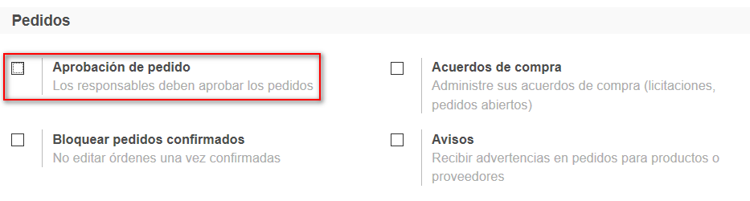

###################################################################################################
Otras caracteristicas
###################################################################################################

Si consultamos la opción de menú Configuración/Ajustes de la App de Compras, 
podremos observar que Odoo nos permite activar (desactivar) algunas caracteristicas extras.

Vamos a ver algunos ejemplos:

*************************************************
Aprobación de pedidos
*************************************************

*************************************************
Avisos
*************************************************

.. image:: media/oc-pedidos-avisos.png
   :align: center
   :scale: 75 %

*************************************************
Más caracteristicas
*************************************************

.. image:: media/oc-pedidos.png
   :align: center
   :scale: 75 %

.. image:: media/oc-facturacion.png
   :align: center
   :scale: 75 %

.. image:: media/oc-productos-logistica.png
   :align: center
   :scale: 75 %

Bloquear pedidos confirmados
============================

Control de facturación
======================

Tarifa de compra
================

Dropshipping
============
