###################################################################################################
Pedidos de Compra
###################################################################################################

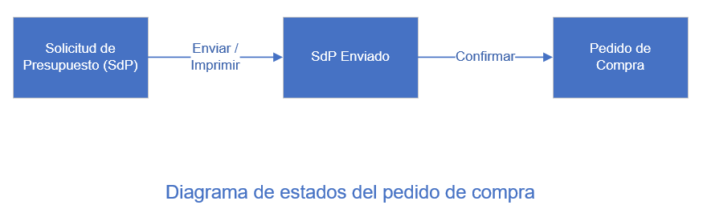

En el módulo de inventario vimos como recepcionar los productos que nos envía un proveedor.

En el ejemplo que vimos, el proveedor nos envió la totalidad del pedido. 

Ahora vamos a ver el caso en el que el proveedor nos envia solo una parte y la otra queda pendiente de envio.

Vamos a iniciar sesión en la base de datos  **computotal-dev** 

*************************************************
Solicitud de Presupuesto (SdP)
*************************************************

Para este ejemplo vamos a ingresar una SdP nueva.

Lo primero que vamos a hacer es verificar la cantidad de pedidos pendientes de recepción.
Eso lo hacemos desde la opción "Tablero" de la aplicación de inventario.
En este caso no tenemos envios pendientes de recepción:

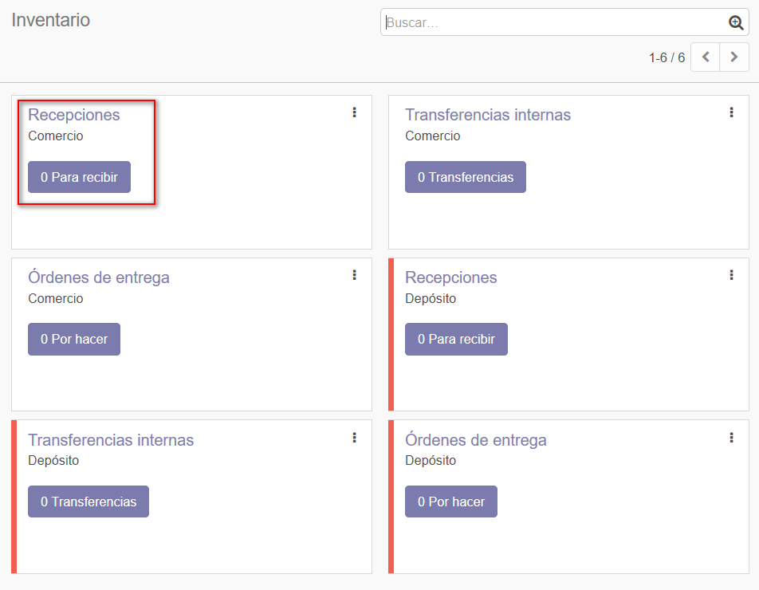

|

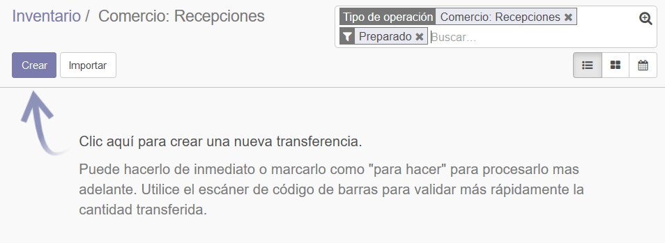

El paso siguiente es consultar los parámetros de la relación del producto con el proveedor.
Esto se hace desde la pestaña "Compra" del formulario de producto. Hacemos clic sobre el renglon
correspondiente de la lista:

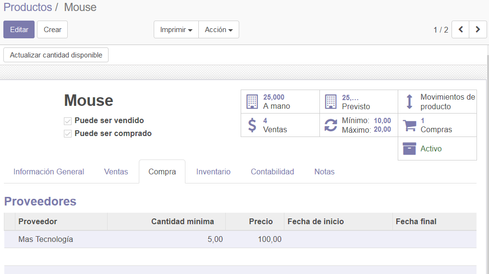

En el formulario que se abre, vamos a prestar atención a los campos "Tiempo inicial de entrega", 
"Cantidad mínima" y "Precio". Cerramos la pantalla sin hacer ninguna modificación:

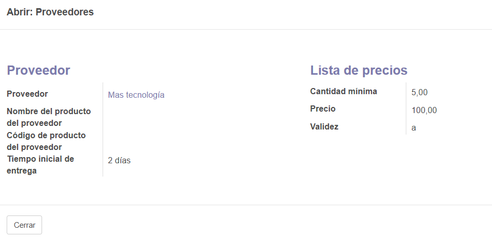

A continuación, vamos a cargar la SdP.
Seleccionamos el proveedor. A la fecha de pedido le asigna automáticamente la fecha del día.
Agregamos un elemento a la lista e informamos el producto (primer columna). Observemos que 
el resto de las columnas se informan automáticamente.
Las columnas "Fecha prevista", "Cantidad" y "Precio unitario" los obtiene de los parámetros
informados en la relación producto-proveedor.
La Fecha prevista se obtiene de sumarle el "Tiempo inicial de entrega" (2 días) a la fecha de
pedido. La Cantidad y Precio unitario se obtienen de forma directa:

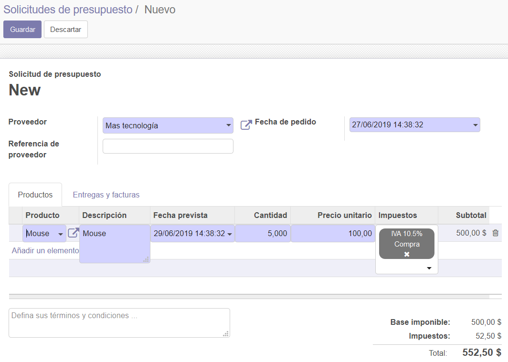

En la pestaña "Entregas y facturas", observemos que está seleccionada la operación "Recepciones" del
Comercio. Esto indica que cuando se confirme el pedido, Odoo generará una recepción pendiente para el 
almacen del Comercio en la aplicación de Inventarios.

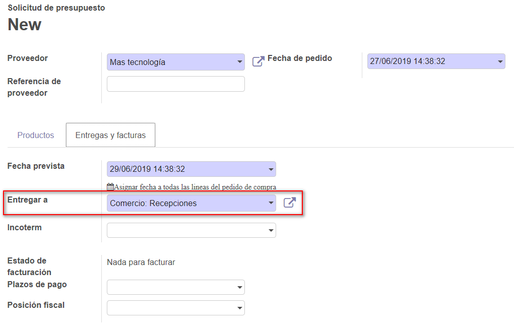

Guardamos la SdP y Odoo nos sugiere la opción de enviarla por correo electrónico o imprimirla.

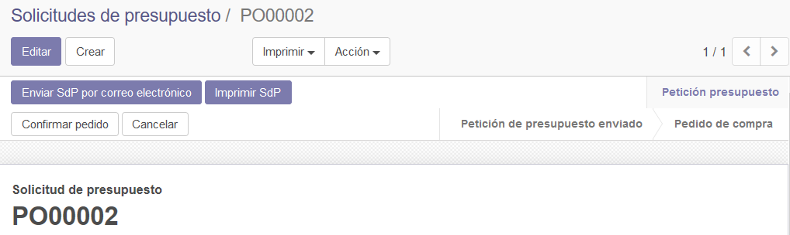

Elegimos imprimirla. Ahora cambia el estado y nos sugiere confirmar el pedido:

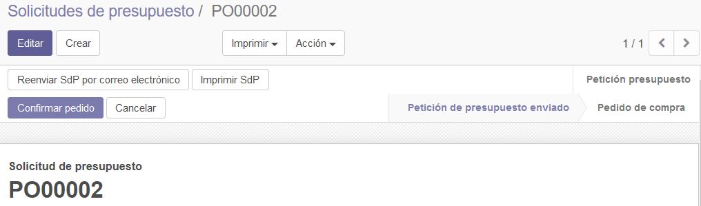

*************************************************
Pedido de compra
*************************************************

Con la confirmación del pedido, Odoo nos genera automáticamente una recepción en el inventario.

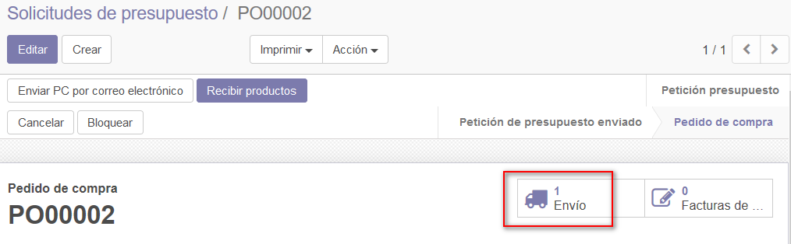

Vemos que la recepción es para el Almacén "Comercio" y que esta preparada para ser recepcionada: 
Hagamos clic en el botón "1 para recibir":

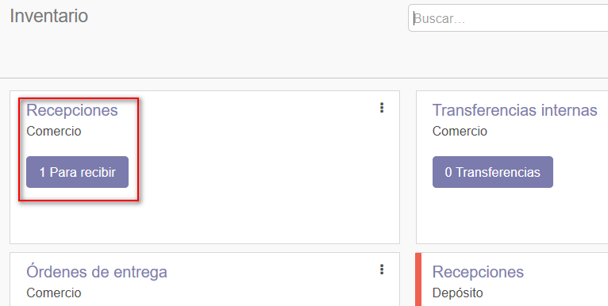

En esta vista de lista, vemos la fecha prevista, el documento de origen y el estado, entre otros datos.

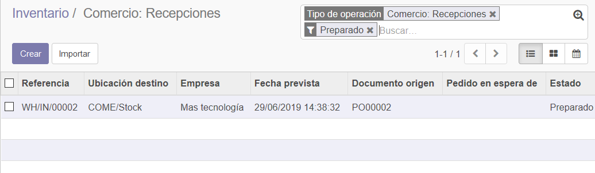

Seleccionemos al recepción haciendo clic en la fila correspondiente.

*************************************************
Recepción
*************************************************

Ya estamos listos para hacer la recepción. Editemos el formulario e informemos en la columna Hecho una 
cantidad inferior al total pedido:

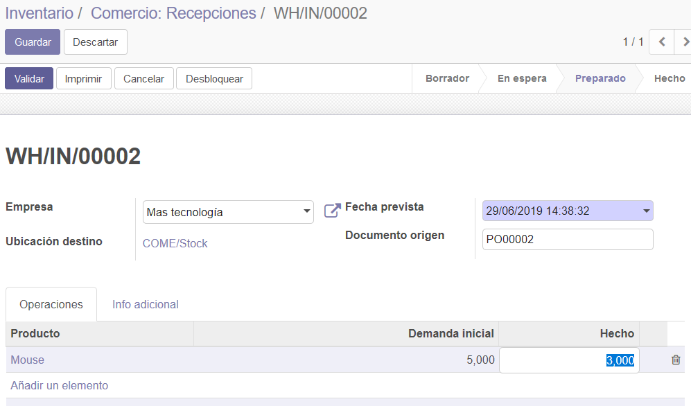

Ahora nos muestra un aviso indicando que estamos recepcionando una cantidad menor a lo pedido.
Seleccionamos "Crear entrega parcial" para que el sistema genere una nueva recepción (en estado preparada)
para los productos pendientes.

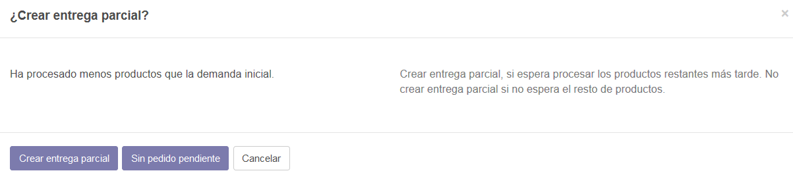

Si consultamos todas las recepciones de Comercio, podemos ver que el documento de Origen PO00002 tiene asociadas
dos recepciones y que estas están vinculadas entre sí mediante el campo "Pedido en espera de".
La recepción pendiente se encuentra en estado "Preparado":

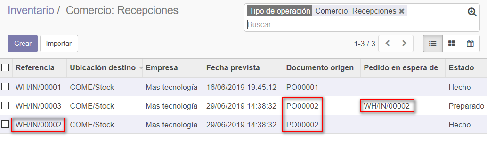

*************************************************
Consultar movimientos
*************************************************

Ahora consultemos el informe "Movimientos de productos" (desde Inventario/Informes).
Observemos el movimiento con referencia "WH/IN/00002". Es la recepción que acabamos de generar
para 3 unidades del producto mouse, con almacén de Origen (De) el del proveedor y como destino (Para) el 
almacen del comercio.

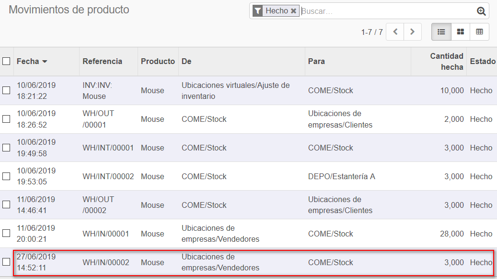
