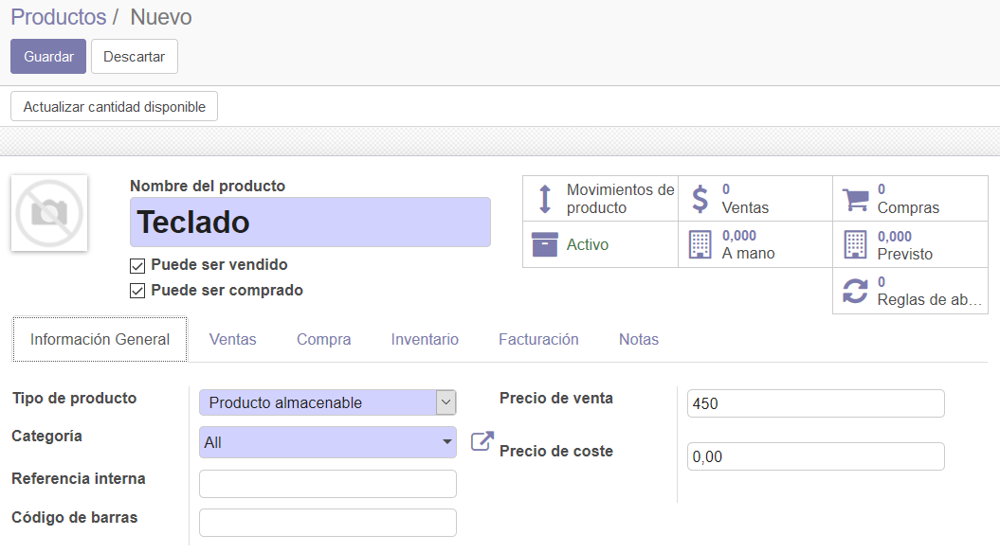
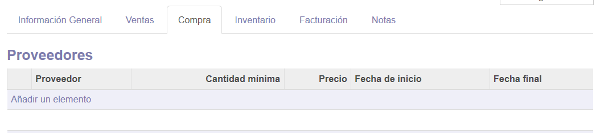
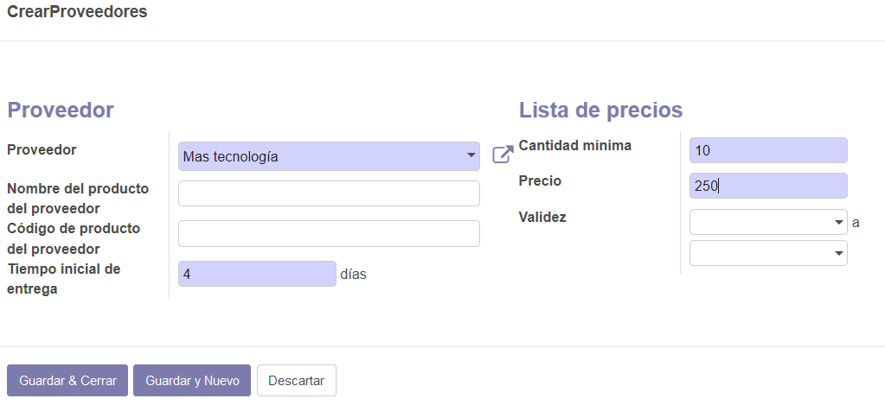
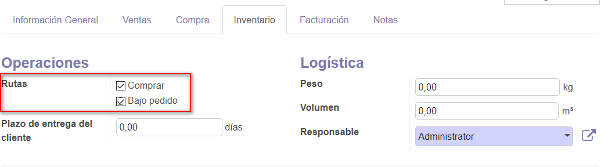
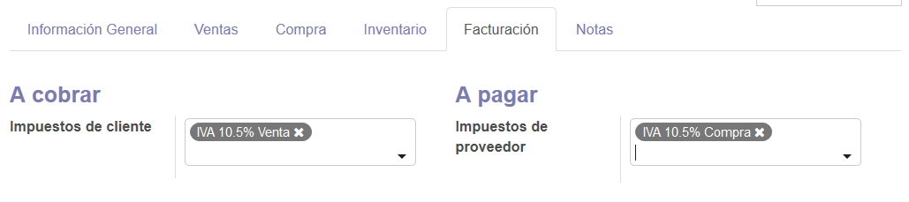
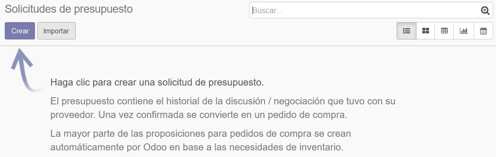
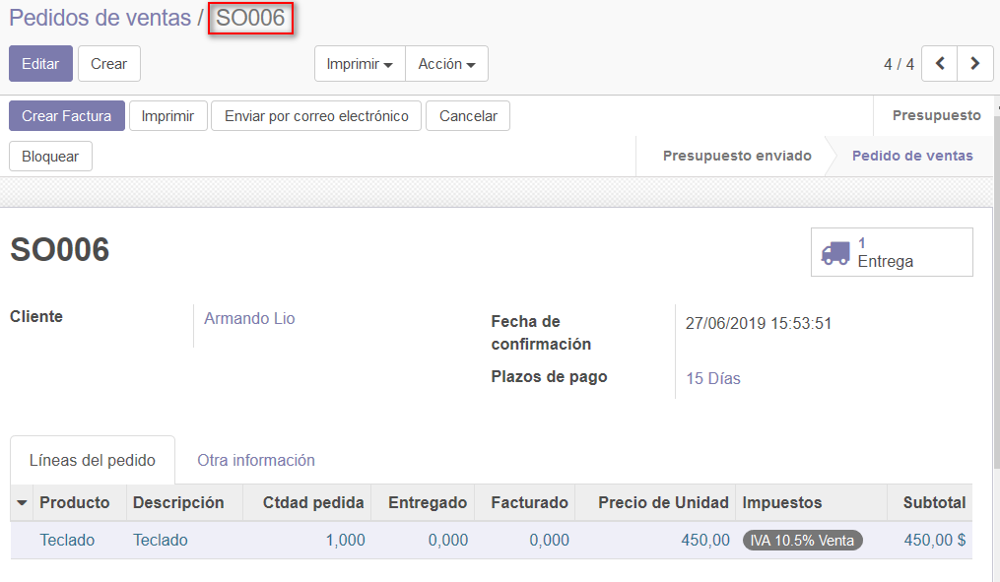
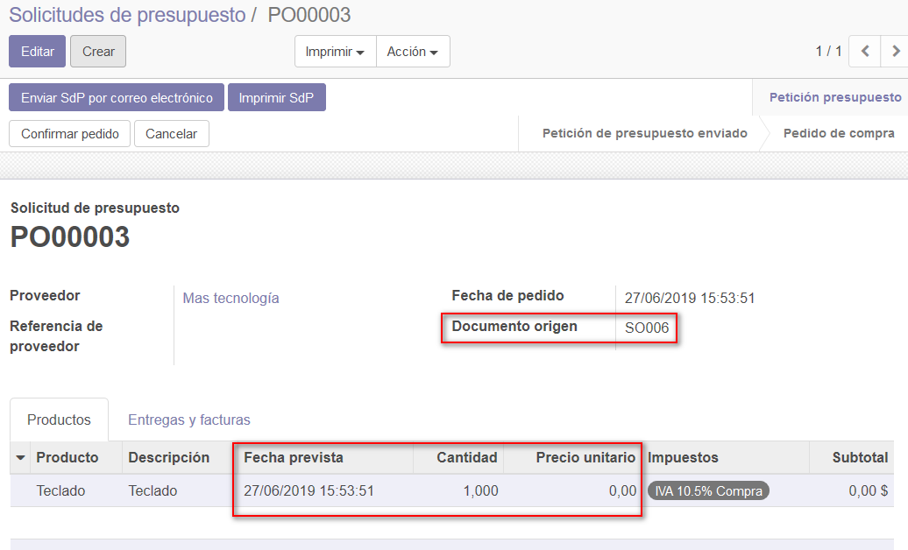
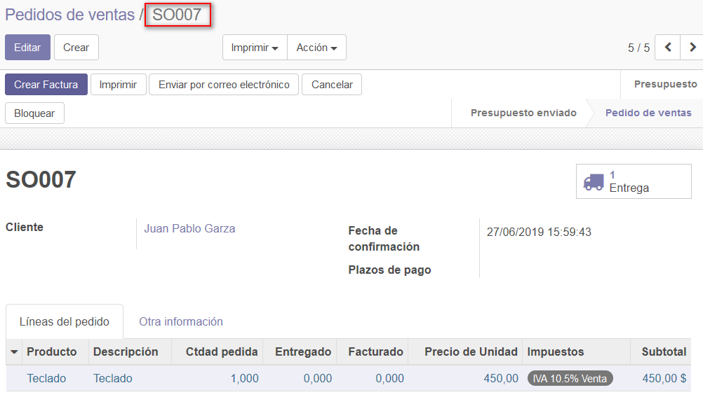
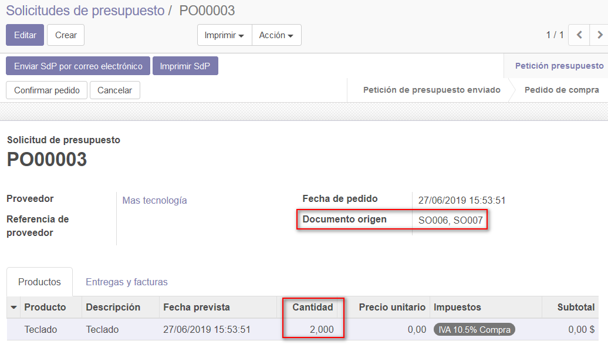

###################################################################################################
Ruta "Bajo Pedido"
###################################################################################################

En el módulo de inventario vimos como funcionaba la ruta "Comprar". 
Ahora vamos a ver el otro tipo de ruta: bajo pedido.

El sistema "Bajo pedido" está pensado para cuando no queremos mantener stock de un producto ya que lo 
vamos a comprar solo en el caso de que tengamos un pedido de algún cliente.

Para se entienda mejor la idea, veamos un ejemplo:

*************************************************
Configurar producto
*************************************************

Para este ejemplo vamos a dar de alta un producto nuevo: Teclado.

Indicamos que es del tipo "Producto almacenable".

Información del proveedor
=========================

Ahora vamos a crear la relación con el proveedor.

Para esto vamos a la pestaña "Compra" del mismo formulario.
Añadimos un elemento a la lista:

Lo configuramos con los siguientes parámetros:

Tildar bajo pedido
==================

En la pestaña "Inventario" del mismo formulario, tildamos las opciones "Comprar" y "Bajo pedido"
para las Rutas. Estas dos rutas tienen que estar activas para que funcione el sistema "Bajo pedido".

En la pestaña "Facturación", configuramos los impuestos tal cual se muestra en la imagen:

Por último, guardamos los cambios y quedamos listos para ingresar un pedido del producto.

*************************************************
Cargar pedido
*************************************************

En compras/Solicitudes de presupuesto, verificamos que en este momento no tenemos ninguna SdP
pendiente:

Desde Ventas/Pedidos, creamos un nuevo pedido de cliente con la siguiente información:

Confirmamos el pedido. Cambia a "Pedido de ventas".

Volvemos a compras/Solicitudes de presupuesto, y vemos que ahora tenemos un SdP pendiente.

Este se generó al confirmar el pedido de cliente.

Si consultamos el SdP, vemos que el Documento de Origen es el pedido de cliente y vemos que 
agregó un renglón con el producto que nos pide nuestro cliente:

*************************************************
Solicitud de presupuesto pendiente
*************************************************

Ahora carguemos otro pedido de cliente para el mismo producto. Lo confirmamos para
que queda en estado "Pedido de ventas".

Si volvemos a compras/Solicitudes de presupuesto y consultamos el SdP pendiente, vemos
que se agregó otra unidad al pedido y que en el campo "Documento origen" ahora nos dice SO006
y SO007.

Este comportamiento se va a verificar mientras la SdP siga pendiente y se sigan ingresando pedidos 
de cliente de productos con la ruta "Bajo pedido" para este mismo proveedor:

