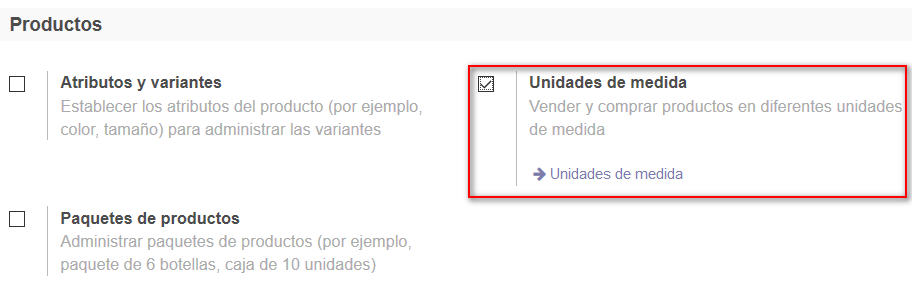
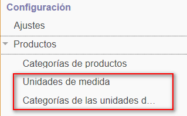
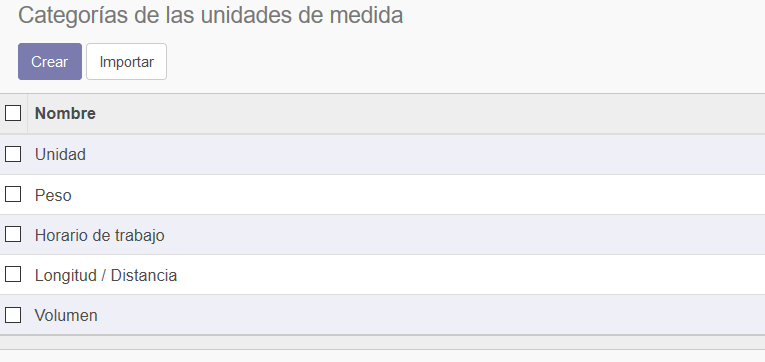
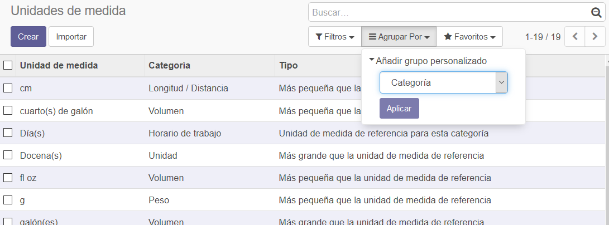
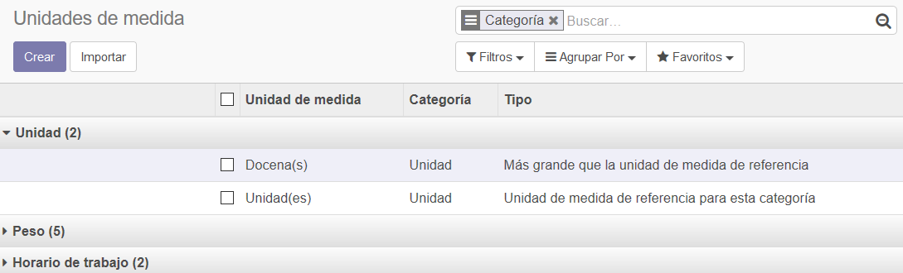
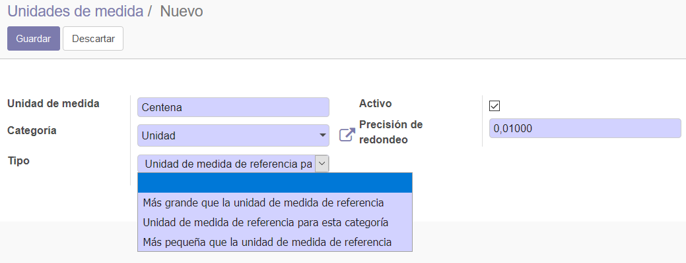
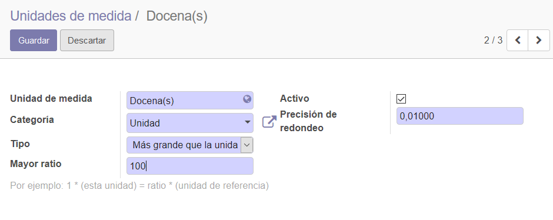
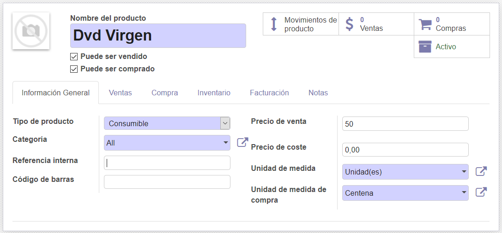
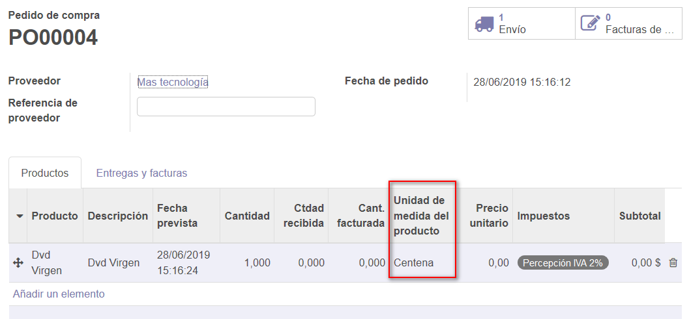
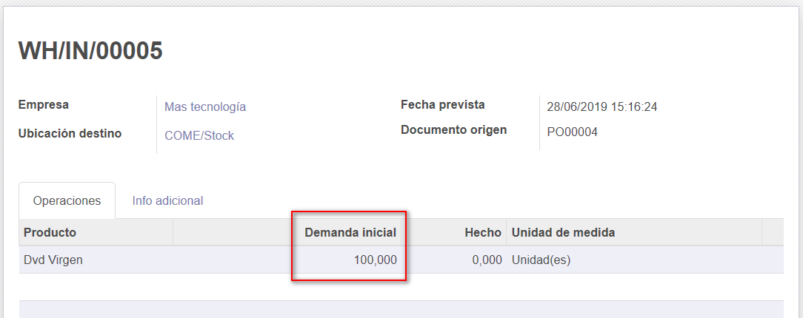

###################################################################################################
Unidades de medida
###################################################################################################

Esta funcionalidad permite administrar unidades de medida diferente entre entre las compras y las ventas.

Un ejemplo en el caso de nuestra empresa ficticia Computotal que compra los DVD's virgen en paquetes 
de 100 unidades y los vende por unidades individuales.

Veamos con un ejemplo los pasos a seguir en estos casos.

*************************************************
Configuración
*************************************************

Para habilitar la funcionalidad debemos acceder a Inventario/Configuración/Ajustes/Productos:

Después de activar la funcionalidad, se muestran dos opciones de menú nuevas:

Una de las opciones permite admnistrar las categorías en las que se pueden clasificar las unidades de medida.

La otra opción, permite gestionar las unidades de medida en Odoo.

Vamos a crear una agrupación personalizada por Categorías para poder analizarlas mejor:

Ahora prestemos atención a la categoría "Unidad".

Odoo trae precargadas dos uom para esa categoría:

En nuestro ejemplo vamos a agregar otra uom para las centenas. La relación con la unidad de medida de 
referencia para la categoría "Unidad" será más grande con un ratio de 100.

*************************************************
Pedido de compra
*************************************************

Ahora vamos a crear el producto nuevo y le vamos a indicar la uom y uom de compra.
Esto lo hacemos desde la pestaña "Información general":

Ahora vamos a cargar un pedido de compra al proveedor por el producto. 

En la imagen podemos apreciar que Odoo automáticamente toma la uom de compra:

Confirmemos el pedido de compra y observemos el movimiento de recepción que nos genera en el inventario.

Odoo convierte automáticamente la uom de compra a la uom de venta, y de esta manera se manejará a partir de ahí
en el stock de Odoo.

