###################################################################################################
Cuentas corrientes
###################################################################################################

*************************************************
Cuenta de cliente
*************************************************

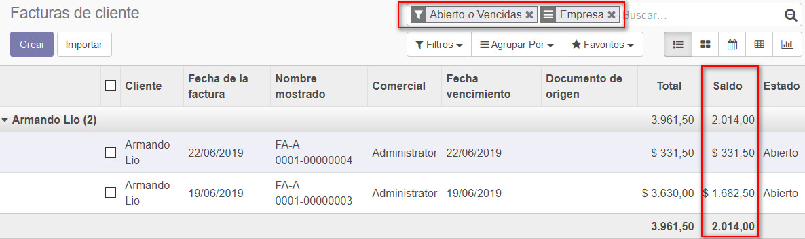

|

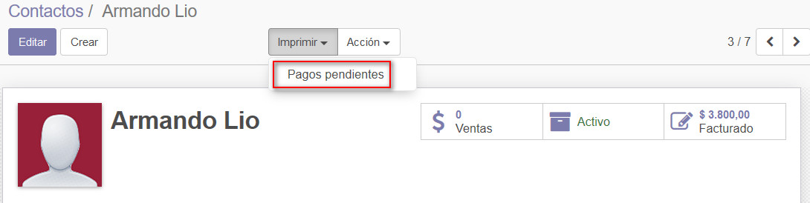

|

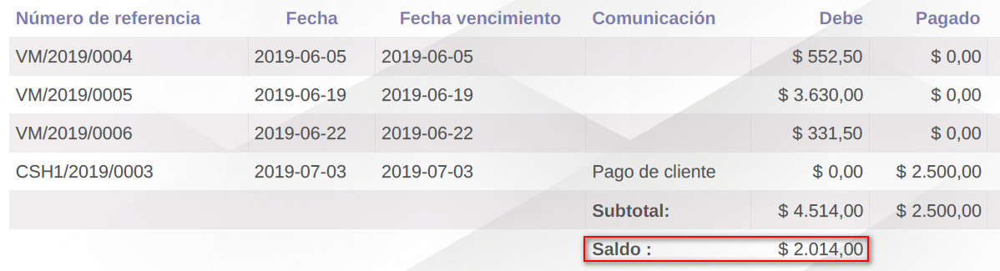

|

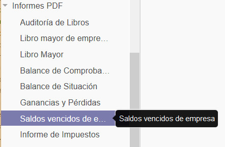

|

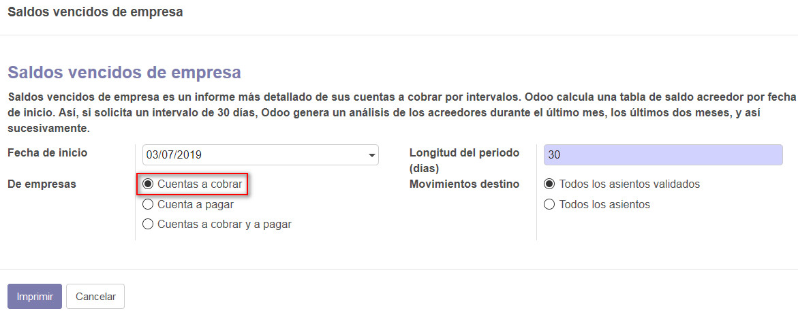

|

.. image:: media/cuenta-cliente-6.jpg
   :align: center
   :scale: 75 %

|

*************************************************
Cuenta de proveedor
*************************************************

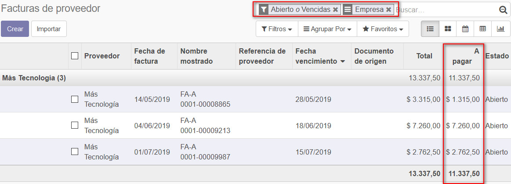

|

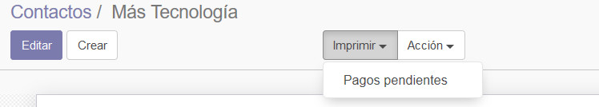

|

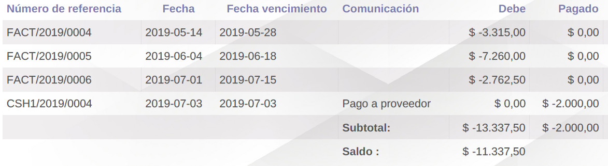

|

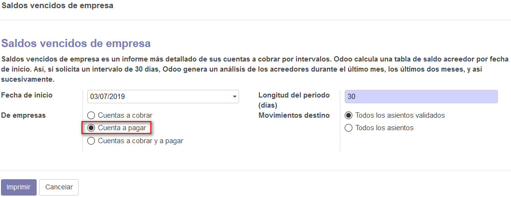

|

.. image:: media/cuenta-proveedor-5.jpg
   :align: center
   :scale: 75 %

|

*************************************************
Cuenta de mixta
*************************************************

Socios que son cliente y proveedor a la vez.

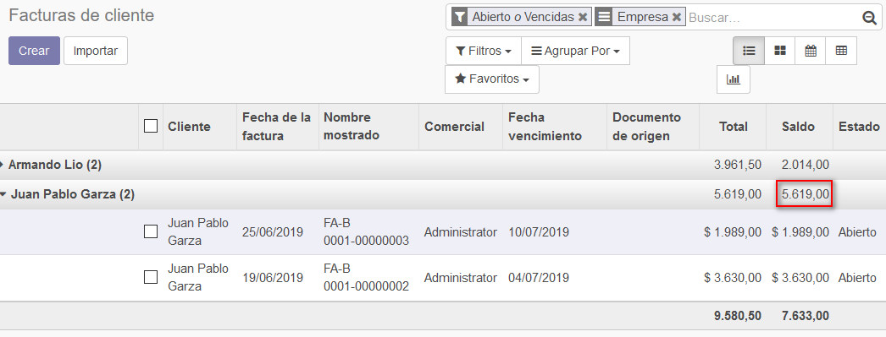

|

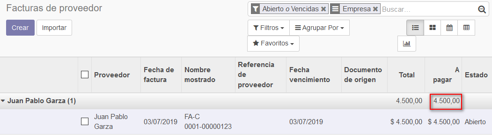

|

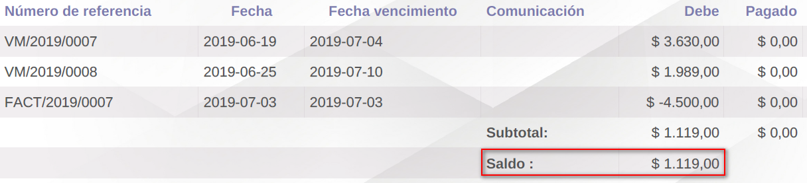

|

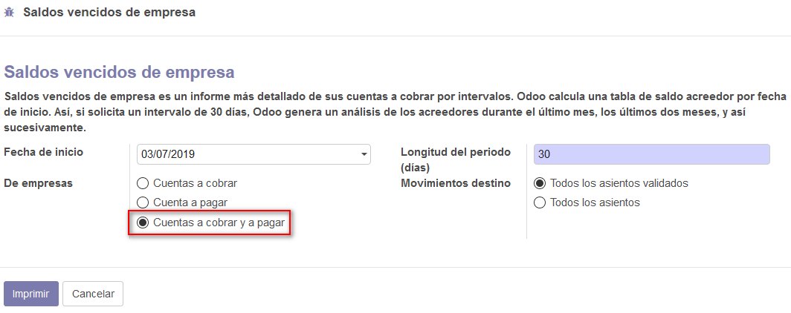

|

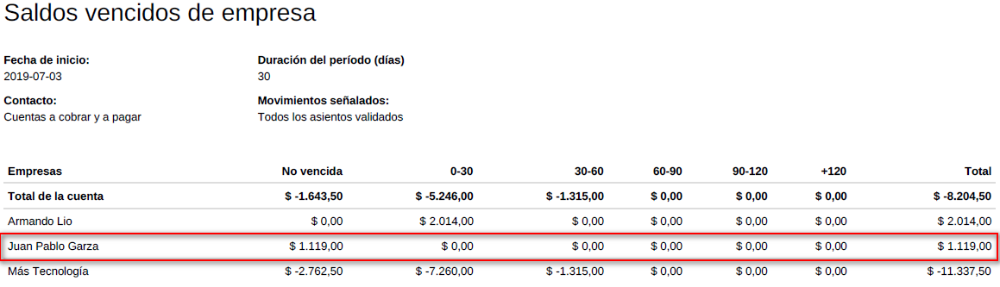

|
