###################################################################################################
Documentos de Ventas
###################################################################################################

Introduction text.

*************************************************
Facturas de cliente
*************************************************

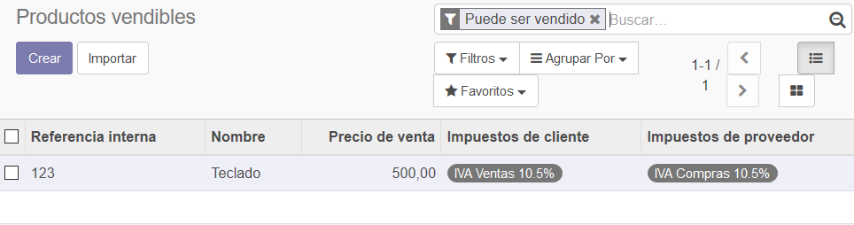

|

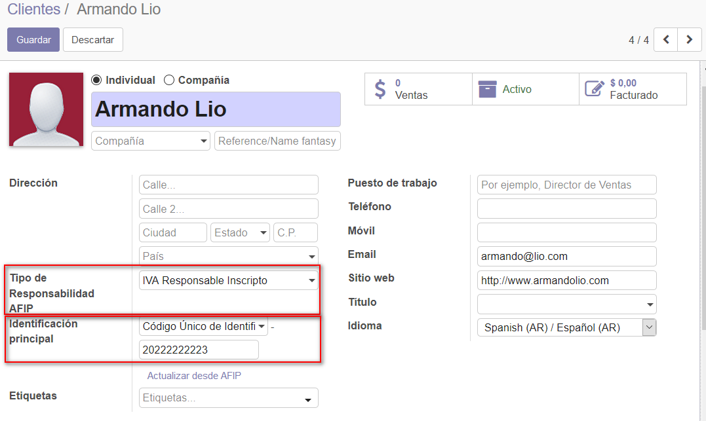

|

.. image:: media/factura-cliente-3.png
   :align: center
   :scale: 75 %

|

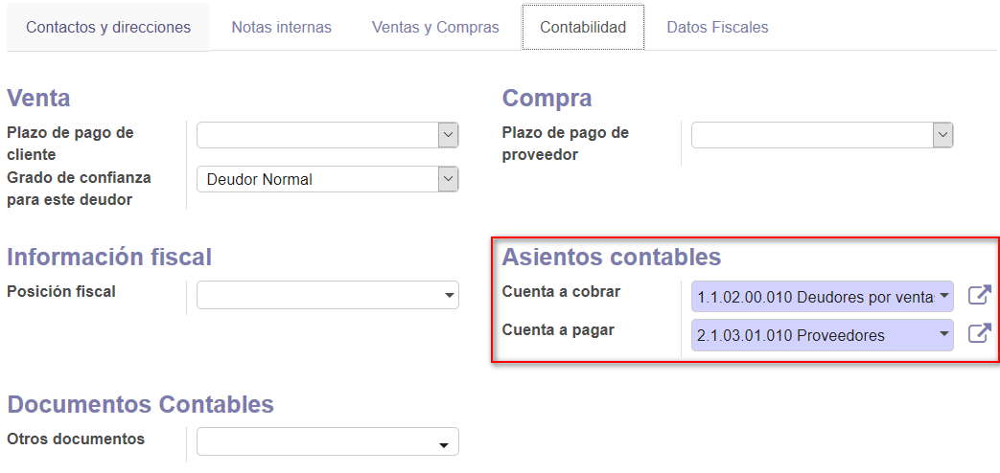

|

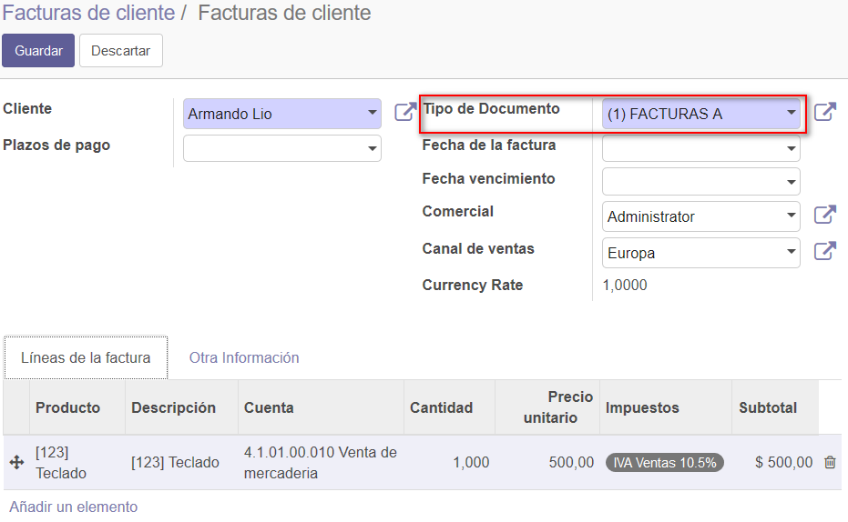

|

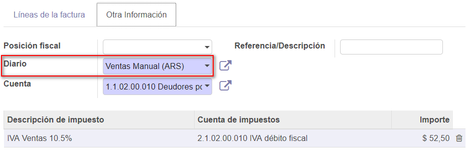

|

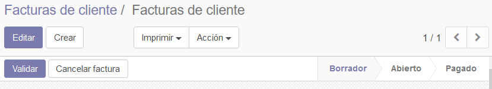

|

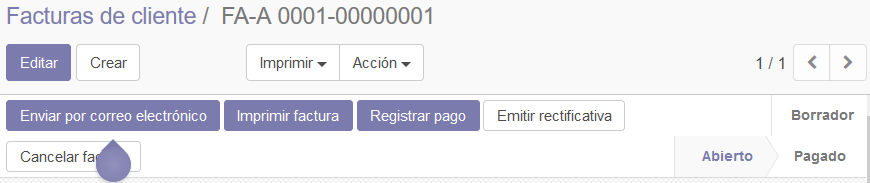

|

.. image:: media/factura-cliente-9.png
   :align: center
   :scale: 75 %

*************************************************
Notas de crédito de cliente
*************************************************

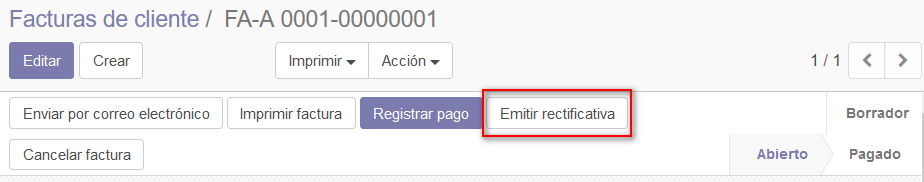

|

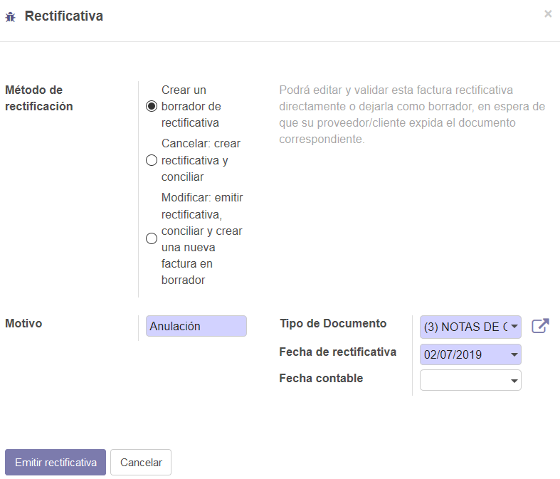

|

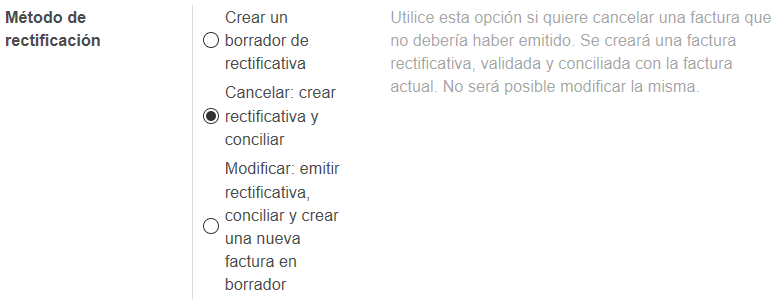

|

.. image:: media/nota-credito-cliente-4.png
   :align: center
   :scale: 75 %

|

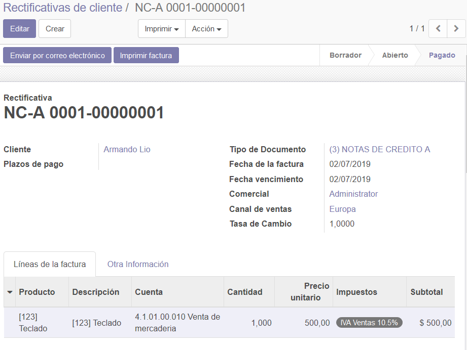

|

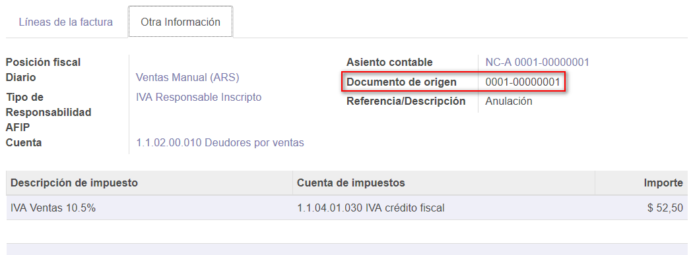

|

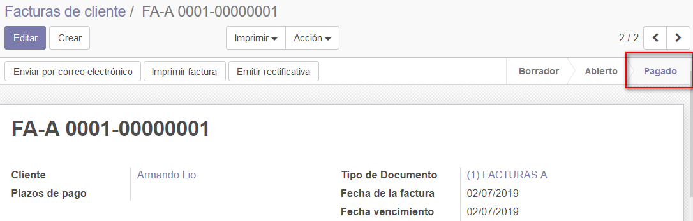

|

*************************************************
Recibos de cliente
*************************************************

Este ejemplo muestra como cargar un pago y emitir el recibo correspondiente:

1. En la vista formulario de la factura a la que deseamos asignar el pago, 
seleccionar la opción "Registrar pago":

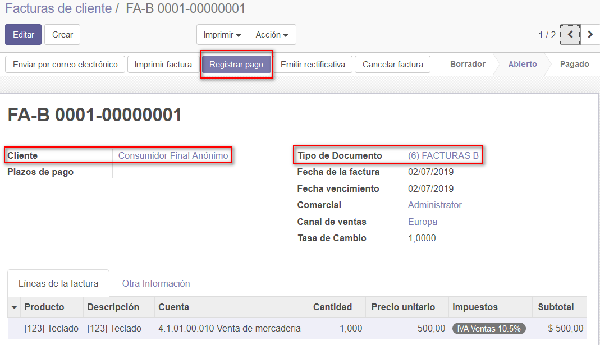

2. La próxima pantalla permite informar los datos relacionados con el pago:

Deuda Seleccionada: propone el cancelar el total de la factura.

En la pestaña "Líneas del pago" seleccionar "Añadir un elemento":

.. image:: media/recibos-cliente-2.png
   :align: center
   :scale: 75 %

3. En esta pantalla tenemos que informar la cantidad a pagar, la forma de pago,
fecha de pago, etc.

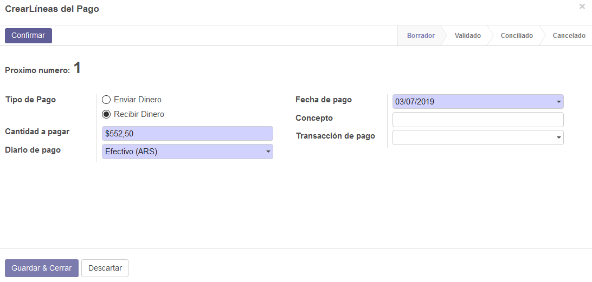

4. Para finalizar seleccionamos la opción "Validar".

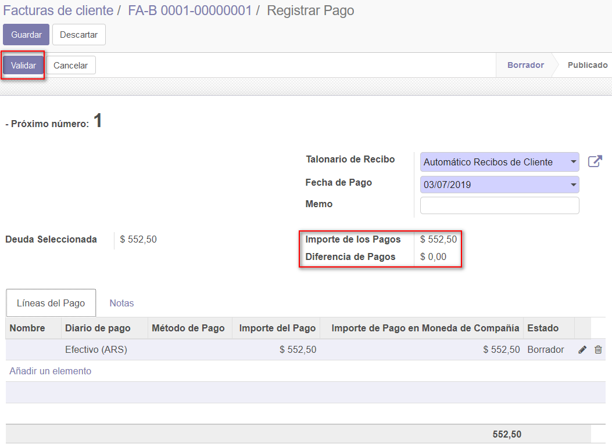

5. La opción "Imprimir" nos permite imprimir el recibo de pago.

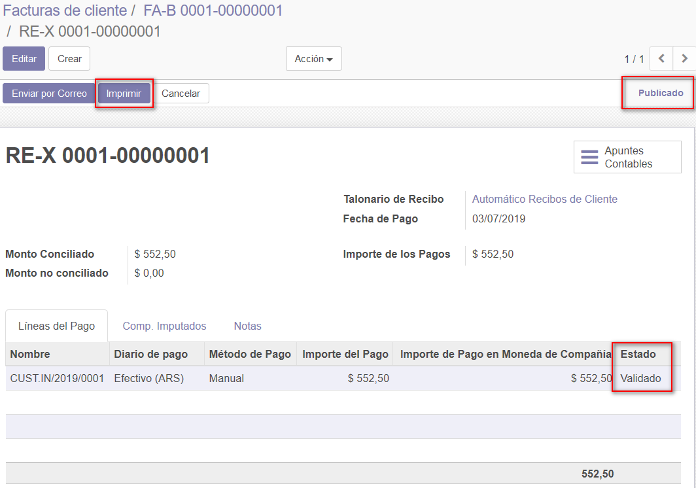

**IMPORTANTE** : para poder imprimir el recibo se necesita tener instalados los 
módulos account_debt_management y l10n_ar_aeroo_payment_group. 
Más información en: :doc:`../mas-modulos/account_debt_management` y :doc:`../mas-modulos/l10n_ar_aeroo_payment_group`.

6. La pestaña "Comp. Imputados" nos muestra la factura a la que se le imputó este pago:

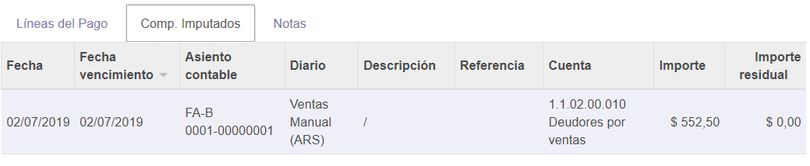

7. La factura cambia de "Abierto" a "Pagado":

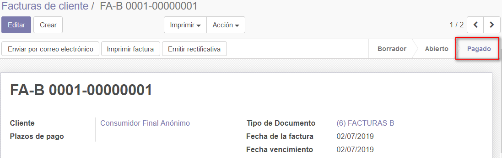
