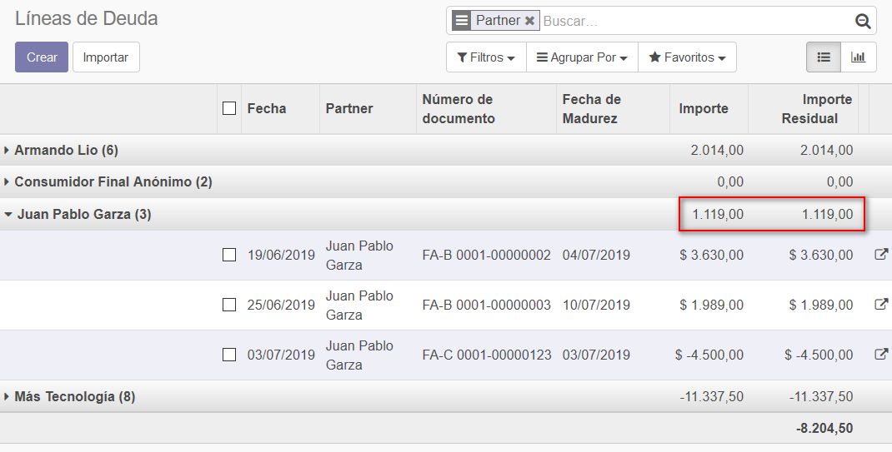
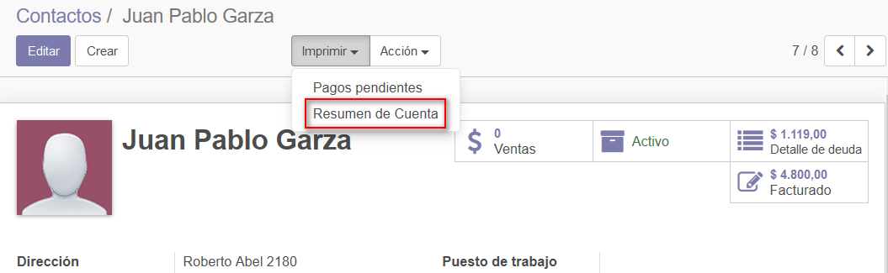
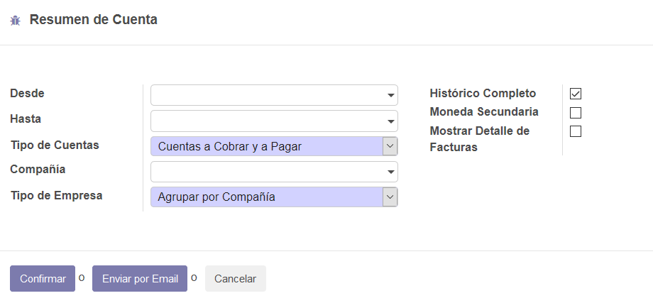
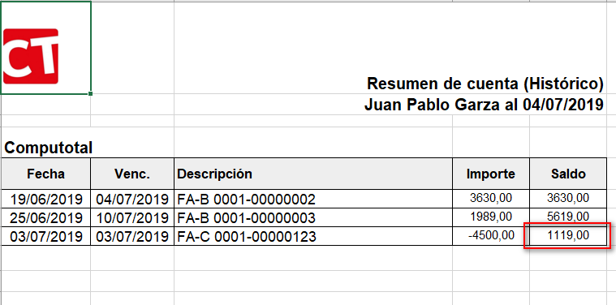
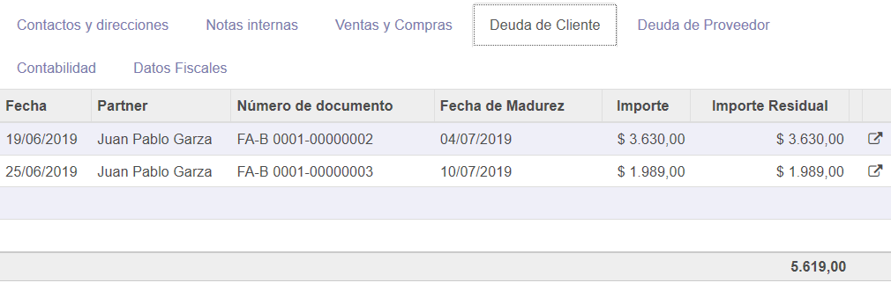
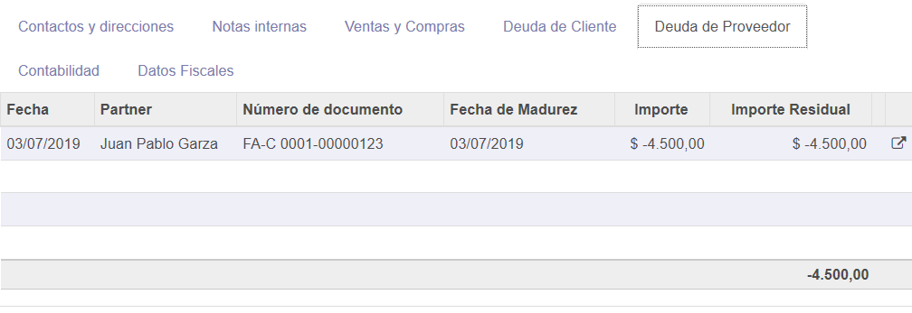
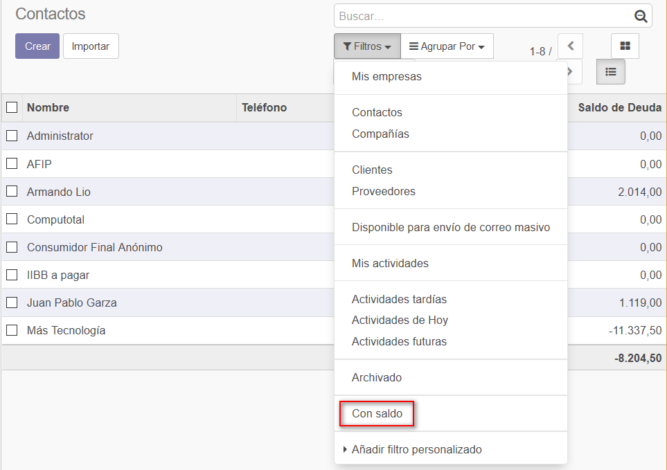
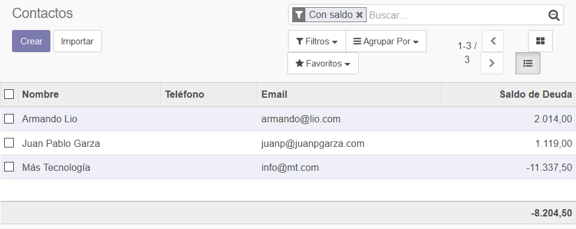

###################################################################################################
Gestión de deudas en cuentas (Account Debt Management)
###################################################################################################

Autor: Adhoc

Repositorio: https://github.com/ingadhoc/account-financial-tools

Licencia: AGPL-3

Contabilidad/Asesor/Resumen de cuenta

Contactos/Vista Formulario/Imprimir/Resumen de cuenta

Contactos/Vista Formulario/Pestaña Deuda de Cliente

Contactos/Vista Formulario/Pestaña Deuda de Proveedor

Contactos/Vista Lista

