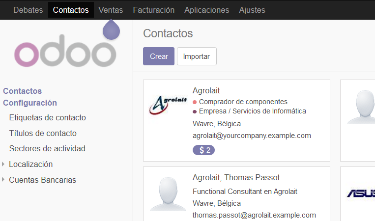
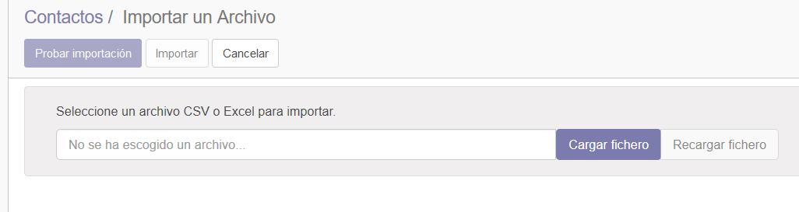
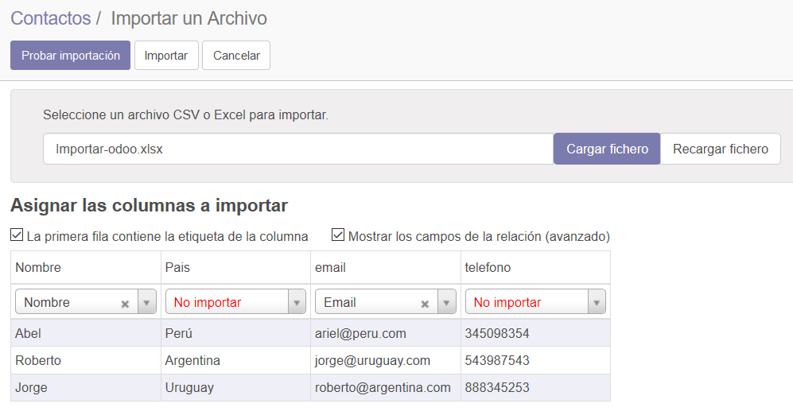
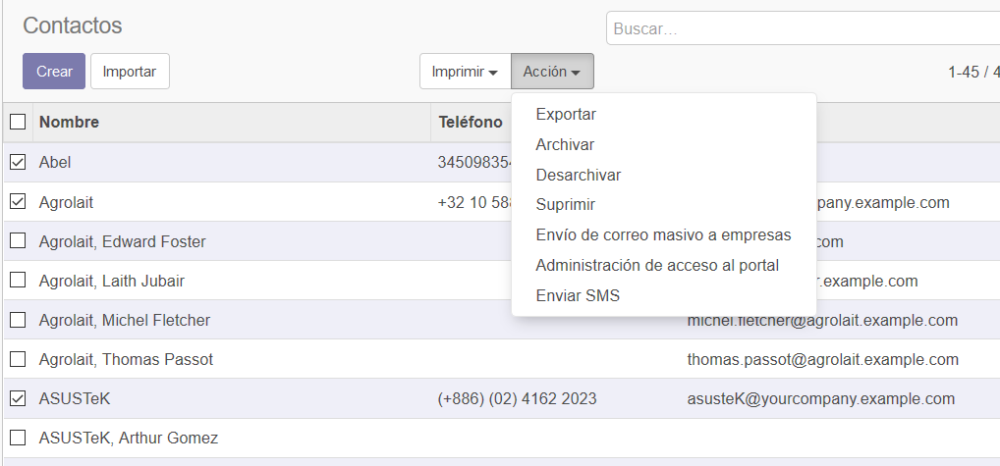
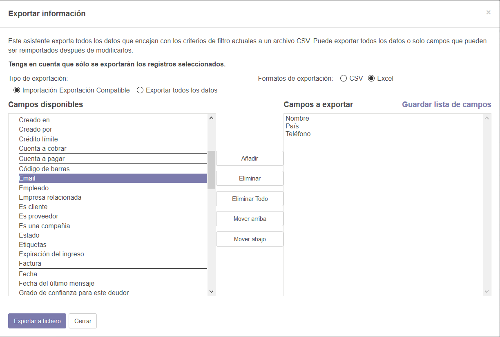

Importación y Exportación en Odoo
=================================

Demostración de las funcionalidades que incorpora Odoo para la migración
de información.

**Apps / Módulos requeridos:**

Directorio de contactos

**Base de datos utilizada:**

Computotal\ **-test**

Importación
-----------

El archivo .xlsx para el ejemplo esta para descargar en el campus
virtual.

|image0|

En el formulario Contactos/Contacto, seleccionar la opción Importar:

|image1|

En el formulario “Importar un Archivo”, seleccionar la opción “Cargar
Fichero”:

|image2|

Se abre un cuadro que permite subir un archivo. Elegir el archivo
Importar-odoo.xlsx:

|image3|

Se sube el archivo y se muestra una previsualización de la importación.
Las columnas cuyos nombres coinciden con los campos de Odoo se unen de
forma automática (Ej. Nombre e email). Las que no, se debe seleccionar a
que campos corresponden:

|image4|

Seleccionar la opción probar importación para asegurarnos que esta todo
correcto para ejecutar el proceso definitivo.

|image5|

El resultado se muestra en un mensaje que se ubica sobre la cuadrícula
de previsualización:

|image6|

Cuando estamos seguros de que todo es correcto, seleccionamos la opción
“Importar”. Odoo copia al directorio del sistema los contactos que
estaban en el archivo.

Exportación
-----------

Nos posicionamos en el formulario Contactos/Contacto. Y seleccionamos la
vista “lista” (a la izquierda debajo del cuadro de búsqueda):

|image7|

Seleccionamos los contactos que deseamos Exportar (clic en check de cada
renglón) y seleccionamos la opción Acción/Exportar:

|image8|

En el próximo formulario, seleccionamos los campos del contacto que
deseamos exportar. Además, el tipo de exportación y el formato del
archivo.

|image9|

Una vez que seleccionamos todos los campos, elegimos la opción “Exportar
a fichero”.

Odoo nos descarga un archivo con el siguiente formato:

|image10|

.. |image0| image:: ./media/image1.png
   :width: 5.05556in
   :height: 2.35716in

.. |image3| image:: ./media/image4.png
   :width: 5.26389in
   :height: 3.88602in

.. |image5| image:: ./media/image6.png
   :width: 4.89367in
   :height: 2.56250in
.. |image6| image:: ./media/image7.png
   :width: 5.61806in
   :height: 3.26222in
.. |image7| image:: ./media/image8.png
   :width: 5.90556in
   :height: 2.27153in

.. |image10| image:: ./media/image11.png
   :width: 5.33333in
   :height: 1.82377in
