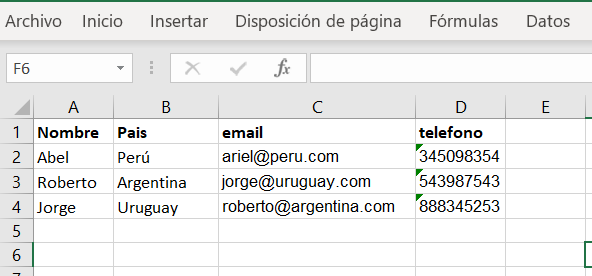
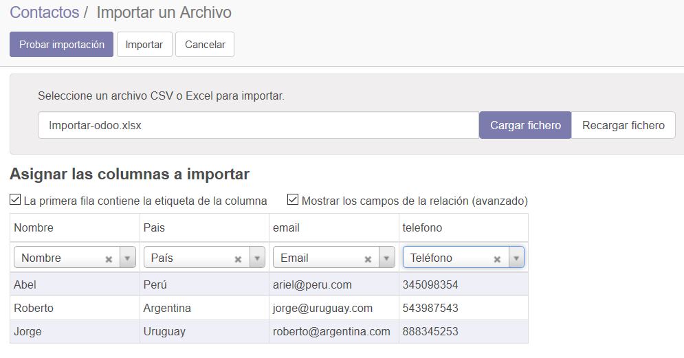
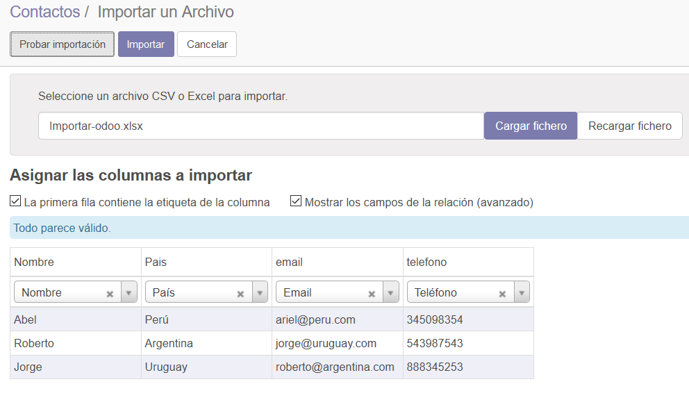
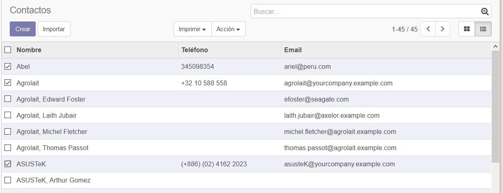
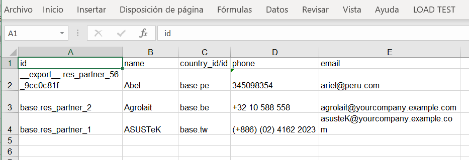

Importación y Exportación en Odoo
=================================

Demostración de las funcionalidades que incorpora Odoo para la migración
de información.

**Apps / Módulos requeridos:**

Directorio de contactos

**Base de datos utilizada:**

Computotal\ **-test**

Importación
-----------

El archivo .xlsx para el ejemplo esta para descargar en el campus
virtual.

En el formulario Contactos/Contacto, seleccionar la opción Importar:

.. image:: media/importar-2.png
   :align: center
   :scale: 75 %

En el formulario “Importar un Archivo”, seleccionar la opción “Cargar
Fichero”:

.. image:: media/importar-3.png
   :align: center
   :scale: 75 %

Se abre un cuadro que permite subir un archivo. Elegir el archivo
Importar-odoo.xlsx:

.. image:: media/importar-4.png
   :align: center
   :scale: 75 %

Se sube el archivo y se muestra una previsualización de la importación.
Las columnas cuyos nombres coinciden con los campos de Odoo se unen de
forma automática (Ej. Nombre e email). Las que no, se debe seleccionar a
que campos corresponden:

.. image:: media/importar-5.png
   :align: center
   :scale: 75 %

Seleccionar la opción probar importación para asegurarnos que esta todo
correcto para ejecutar el proceso definitivo.

El resultado se muestra en un mensaje que se ubica sobre la cuadrícula
de previsualización:

Cuando estamos seguros de que todo es correcto, seleccionamos la opción
“Importar”. Odoo copia al directorio del sistema los contactos que
estaban en el archivo.

Exportación
-----------

Nos posicionamos en el formulario Contactos/Contacto. Y seleccionamos la
vista “lista” (a la izquierda debajo del cuadro de búsqueda):

Seleccionamos los contactos que deseamos Exportar (clic en check de cada
renglón) y seleccionamos la opción Acción/Exportar:

.. image:: media/exportar-2.png
   :align: center
   :scale: 75 %

En el próximo formulario, seleccionamos los campos del contacto que
deseamos exportar. Además, el tipo de exportación y el formato del
archivo.

.. image:: media/exportar-3.png
   :align: center
   :scale: 75 %

Una vez que seleccionamos todos los campos, elegimos la opción “Exportar
a fichero”.

Odoo nos descarga un archivo con el siguiente formato:

