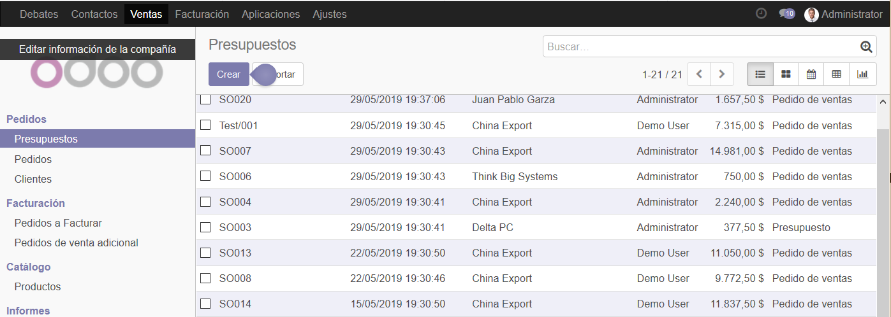
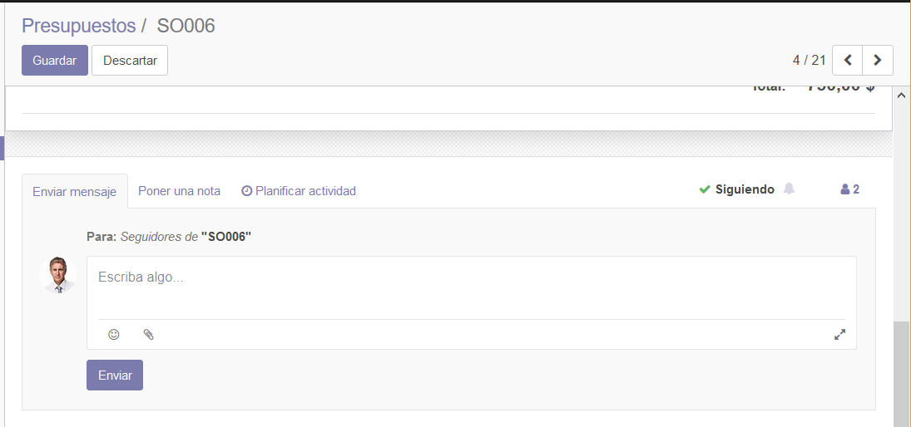
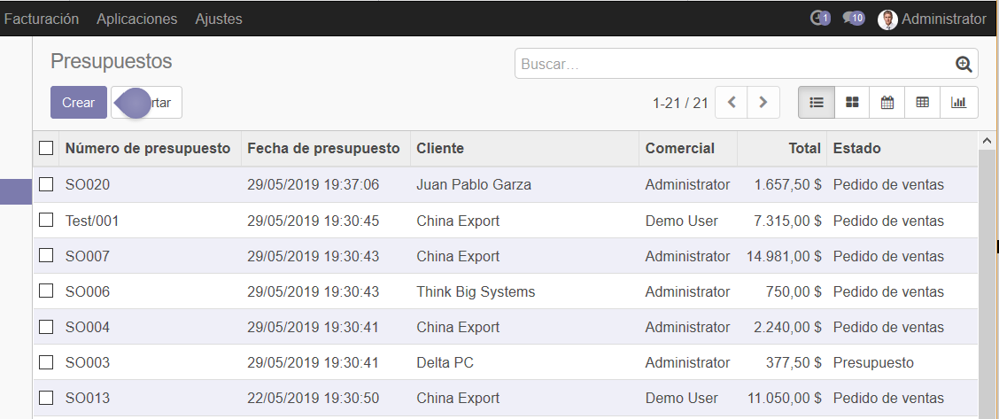
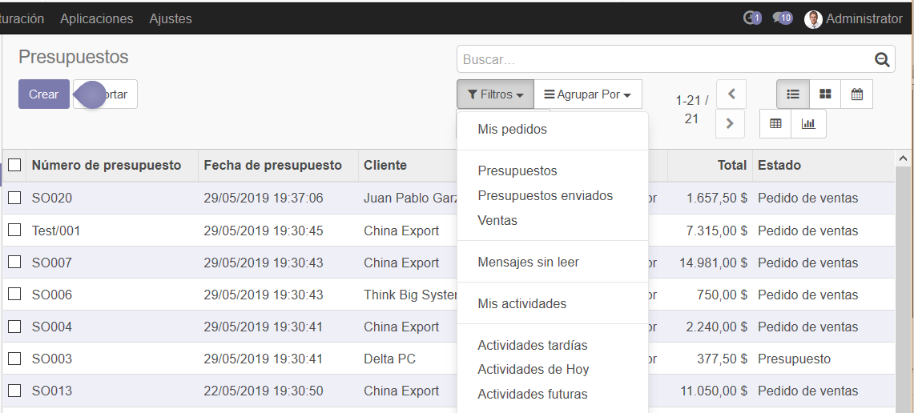
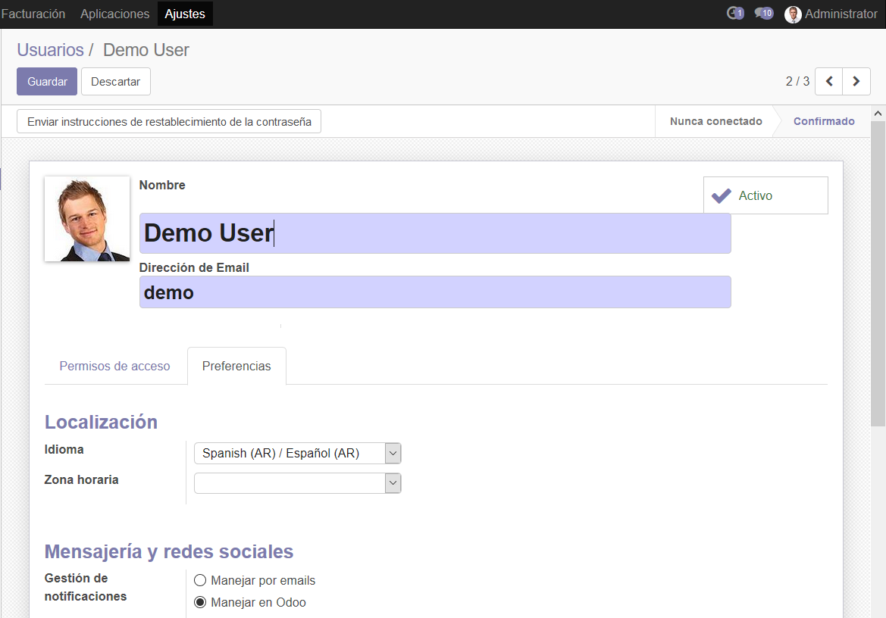

Odoo OpenChatter
================

Openchatter es una herramienta para la comunicación entre los contactos
y usuarios de Odoo.

**Apps / Módulos requeridos:**

Gestión de Ventas

**Base de datos utilizada:**

Computotal\ **-test**

En el formulario Ventas/Presupuestos, seleccionamos el presupuesto
SO006:

|image0|

En la parte inferior del formulario, podemos observar las
funcionalidades de comunicación que proporciona Odoo.

Nos permite enviar un mensaje a usuarios que son seguidores de un
documento:

|image1|

Dejar una nota para la propia lectura o la de otro usuario.

|image2|

Planificar una actividad a realizar relacionada con el documento que
estamos editando:

|image3|

En la esquina superior derecha, odoo nos muestra un relojito que nos
indica que tenemos actividades pendientes. Al lado, nos muestra un
globito que nos indica la cantidad de mensajes que tenemos pendientes de
visualizar.

|image4|

Los filtros Mis actividades, Actividades tardías, futuras, etc. me
permitirán filtrar los presupuestos sobre los que tengo actividades
pendientes de realizar:

|image5|

**Importante.**

Se debe configurar a los usuarios para que la mensajería se gestione por
Odoo para poder seguir el ejemplo sin necesidad de configurar las
cuentas de mails de cada usuario.

Ver ejemplo:

|image6|

.. |image2| image:: ./media/image3.png
   :width: 5.90556in
   :height: 2.55903in
.. |image3| image:: ./media/image4.png
   :width: 5.90556in
   :height: 3.23889in

