##########################################
Comandos básicos Docker
##########################################

En esta sección veremos algunos de los comandos docker que más utilizaremos
dentro de este curso.

***************
Docker compose
***************

Para probar estos comandos debemos cambiar al directorio proyecto1:

.. code-block:: console

   $ cd ~/odoo-dev/11/proyecto1

Para levantar los contenedores de Odoo hacemos:

.. code-block:: console

   $ docker-compose up -d

Si le quitamos el parámetro "d" nos muestra el log de los procesos que se 
ejecutan en los contenedores:

.. code-block:: console

   $ docker-compose up

Para detener los contenedores hacemos:

.. code-block:: console

   $ docker-compose down

y para reiniciarlos:

.. code-block:: console

   $ docker-compose restart

Docker compose es una herramienta que nos facilita la gestión de todos los recursos
asociados al entorno de ejecución de docker.

Analicemos un poco la estructura del archivo docker-compose.yml.
En este archivo se definen todos los parámetros que utilizaran los contenedores del
entorno de ejecución de Odoo.

En la imagen siguiente se muestra la sección del archivo en donde se definen los 
parámetros del contenedor de Odoo.

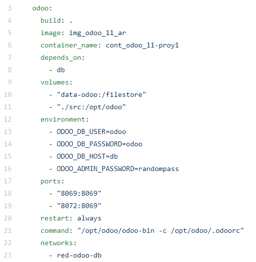

A continuación se describe brevemente el significado de cada etiqueta:

**build:** indica el directorio en el que se debe generar la imagen.
Es solo para el caso en que se necesite hacerlo.

**image:**  es la imagen de docker que se debe utilizar para generar el contenedor.

**container_name:** es el nombre que se le asignará al contenedor.

**depends_on:** se le está diciendo a docker-compose que para ejecutar el contenedor de
Odoo es necesario primero ejecutar el contenedor de la base de datos postgres.
En la imagen siguiente se muestra la sección del archivo donde se define este contenedor.

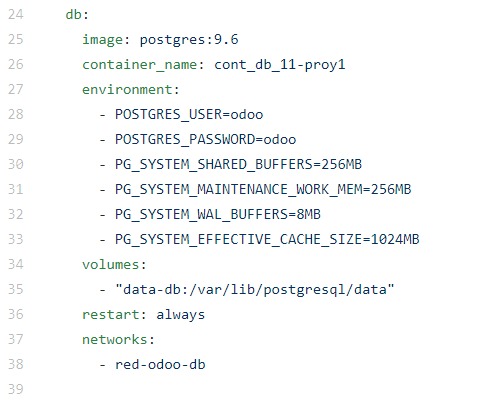

**volumes:** indica los directorios del host que se compartirán con el contenedor.

**enviroment:**  variables para indicar los datos de autenticación con la base de datos.

**ports:** indica como será la correspondencia entre puertos del contenedor y el host. 
Para conectarnos con Odoo usamos el 8069.

**restart:** indica la politica de reinicio que se debe aplicar al contenedor.
Le podemos decir que nunca reinicie, solo en el caso de falla o siempre.

**command:** indica el comando que se debe ejecutar cuando se inicia el contenedor.
En nuestro caso estamos ejecutando el comando que inicia el servidor de Odoo.

**networks:**  se indica la red a la que se conectará el contenedor.

En las últimas dos secciones del archivo se definen los volumenes y la red que se van
a utilizar:

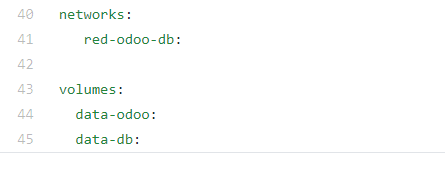

***************
Contenedores
***************

Luego de ejecutar el comando **"docker-compose up -d"**, observamos que se inician el contenedor
de Odoo, el contenedor de la base de datos y la red que los comunica:

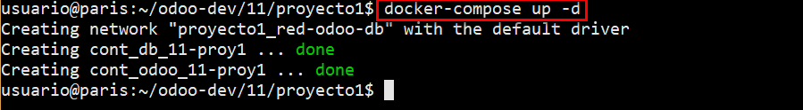

**"docker ps"** lista los contenedores activos. 
En nuestro caso, cont_odoo_11-proy1 y cont_db_11-proy1:

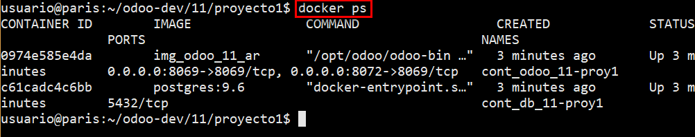

**"docker logs -f"** muestra el log del proceso que se está ejecutando en el contenedor:

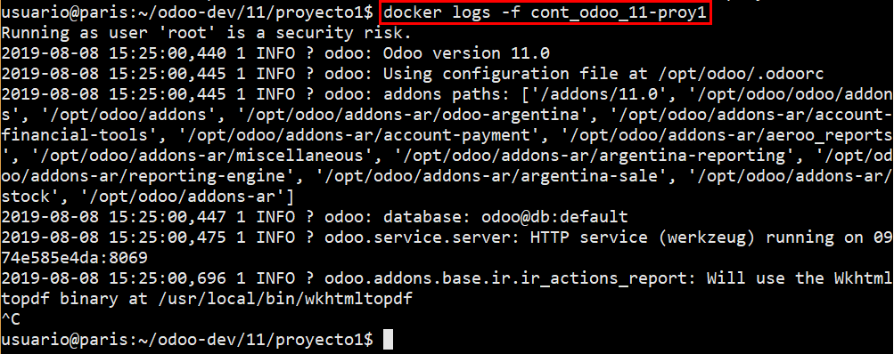

**"docker exec -it"** nos permite ingresar a nuestro contenedor y ejecutar un comando.
En este ejemplo, se ejecuta un bash en el contenedor cont_odoo_11-proy1.
Para volver al host, ejecutar "exit"

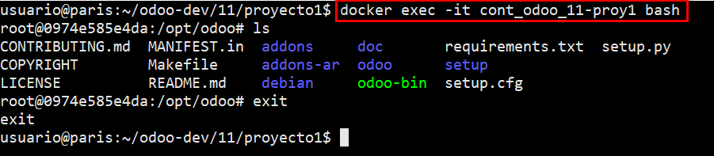

**"docker volume ls"**  lista los volumenes activos:

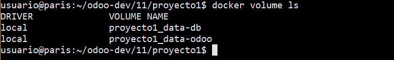

**"docker network ls"**  lista las redes activas:

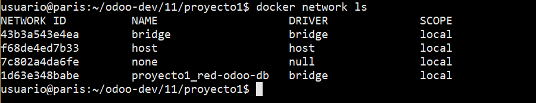

***************
Imagenes
***************

El comando **"docker image"**  nos permite listar las imagenes de docker que tenemos en el sistema:

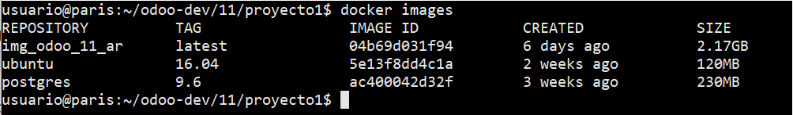

**"docker save"**  nos permite guardar una imagen para luego copiarla a otra máquina:

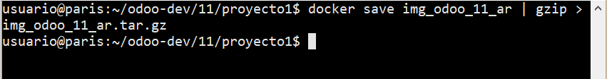

Luego copiamos el archivo "img_odoo_11_ar.tar.gz" a la máquina destino y ejecutamos:

.. code-block:: console

   $ gunzip -c img_odoo_11_ar.tar.gz | docker load
