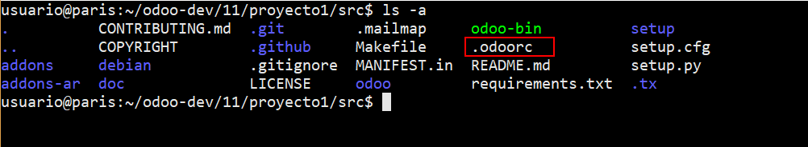
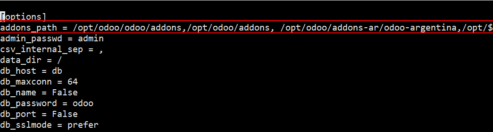
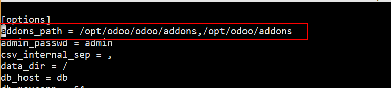

##########################################
Configuración del servidor de Odoo
##########################################

El servidor de Odoo permite configurar multiples parámetros.

Con este comando podremos consultar las opciones disponibles:

.. code-block:: console

   $ ./odoo-bin --help

*************************************************
Archivo de configuración
*************************************************

La mayoría de las opciones pueden ser guardadas en el archivo de configuración.

En nuestro caso, el archivo de configuración se llama .odoorc y se encuentra
en el directorio src de proyecto1:

Para indicarle al servidor que se inicie tomando los parámetros de nuestro archivo
de configuración usaremos la opción -c y a continuación el nombre del archivo:

.. code-block:: console

   $ ./odoo-bin -c .odoorc

En la sección anterior vimos como en el archivo docker-compose.yml se indica este mismo
comando en la etiqueta "command".

*************************************************
Addons path
*************************************************

El addons_path es el parámetro del servidor que nos permite indicar los directorios en 
los que Odoo deberá buscar los módulos que deben quedar disponibles para instalar.

Utilizaremos el archivo de configuración .odoorc para setear este parámetro:

Si observamos detenidamente contenido del addons_path, veremos que los dos primeros elementos
(/opt/odoo/odoo/addons, /opt/odoo/addons) corresponden a los path de los módulos standar de 
Odoo.
Los módulos que comienzan con /opt/odoo/addons-ar (todos los que siguen después de los primeros dos)
corresponden a los módulos de la localización Argentina de Odoo.

En la primera parte de este curso no utilizaremos ninguna localización. Entonces quitaremos los elementos
correspondientes a la localización Argentina del addons_path.

Finalmente el archivo nos debería quedar así:

Para que Odoo tome la nueva configuración, deberemos reiniciar el servidor.
Para esto utilizaremos el siguiente comando:

.. code-block:: console

   $ docker-compose restart
