###################################################################################################
Variantes de productos
###################################################################################################

Esta funcionalidad permite soportar productos que tienen distintas variantes tales como color, talle, etc.

Dentro de la gestión de este tipo de productos tendremos el concepto de modelo (ej camiseta manga corta GAP)
y el de variante del un modelo (ej. camiseta manga corta GAP Talle S Color rojo). Y además, el concepto de
atributo que en este caso serían el color y el talle.

Veamos un ejemplo para nuestra empresa ficticia. Supongamos que tenemos un modelo de Mouse que viene en 
distintos colores (Atributo).

Para habilitar la funcionalidad, tenemos que ir a: Ventas/Configuración/Ajustes/Catálogo del producto
y tildar "Atributos y Variantes".

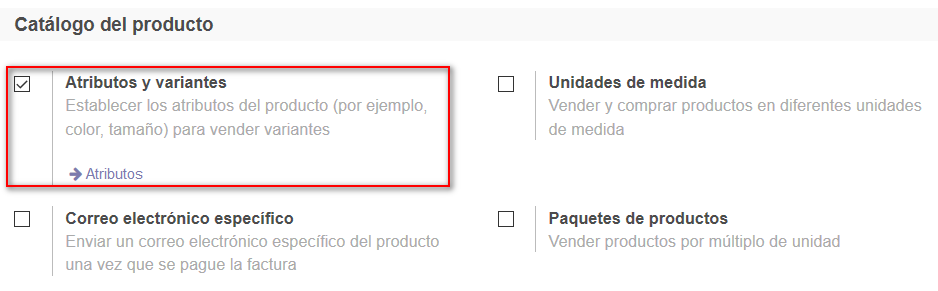

Luego de Guardar la Configuración, veremos que nos agrega dos opciones de menú nuevas:

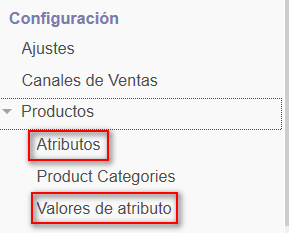

En la opción Atributos, informaremos un atributo nuevo. En este caso, será el color:

.. image:: media/atributos-y-variantes-3.png
   :align: center
   :scale: 75 %

Luego, en la opción Valores de atributo, informamos los colores disponibles:

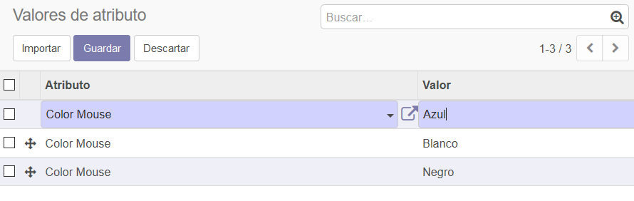

Observemos que, al activar la funcionalidad de Variantes, nos agrega una opción de menú que nos da 
una vista nueva de los productos.
Como todavía no informamos variantes para ningún producto, esta vista nos muestra lo
mismo que la vista tradicional (que se accede desde el menú "Productos")

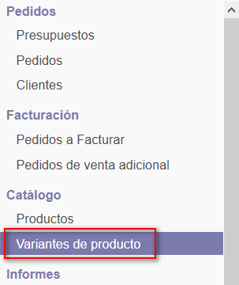

Ahora agreguemos el producto Mouse Genius y, en la pestaña Variantes, informemos los atributos de color:

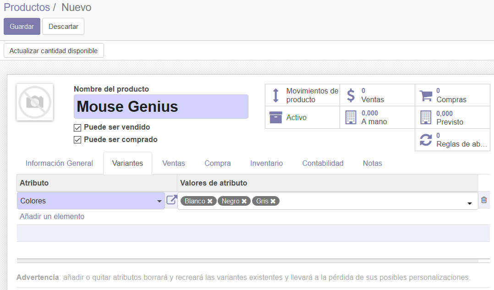

Cuando guardamos el producto vemos que nos habilita nuevas opciones:

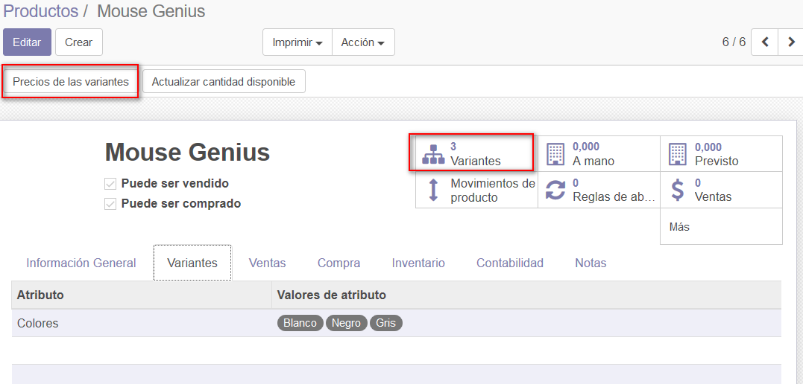

La opción "Precios de las variantes" nos permite manejar precios distintos por variante.
Funciona tomando como base el precio de venta y sumandole un importe extra para el atributo 
que indiquemos.

En nuestro caso, indicamos que los mouse genius de color negro y gris van a costar $ 50 y $ 100 más
respectivamente, que el precio base.

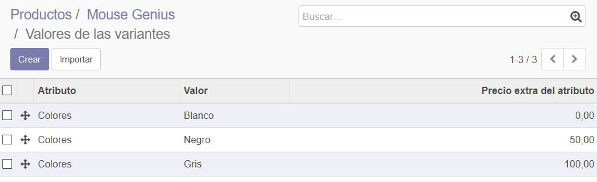

Ahora informemos el stock inicial del producto. Vemos que nos va a dar la opción de informar la cantidad
inicial de cada variante:

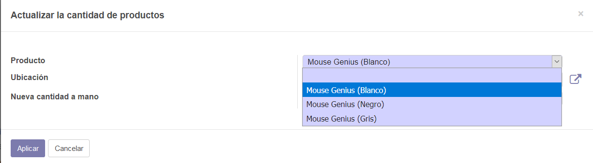

Dentro de la consulta del producto, naveguemos hacia el detalle de las variantes (Botón inteligente "Variantes").

Vamos a ver la lista de las variantes del producto, con el detalle del precio de venta y las cantidades en stock de
cada una.

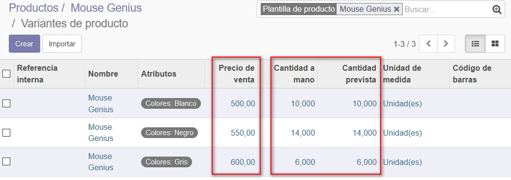

Si seleccionamos un elemento de la lista, nos lleva a un formulario que nos permite informar más datos propios de la 
variante.

En nuestro ejemplo, elegimos una a una las variantes y les informamos el código de barras.

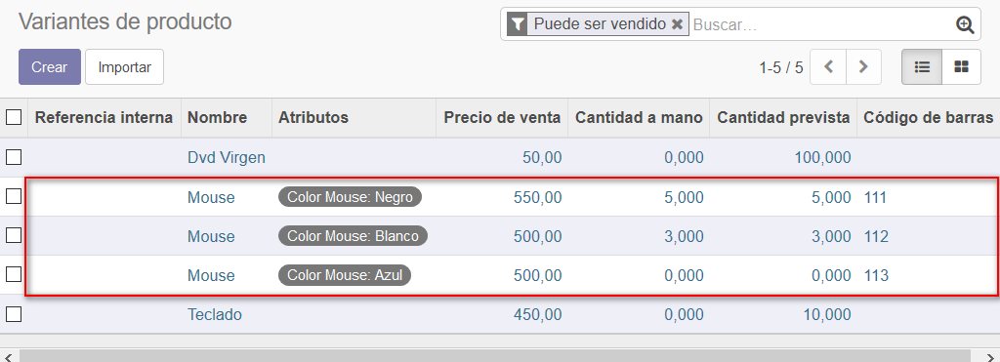

De esta manera, vemos que nos permite que cada variante tenga su propio código de barras:

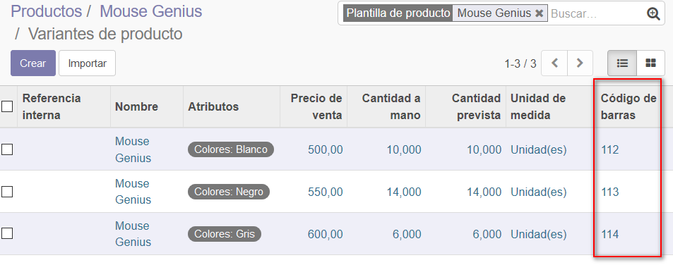
