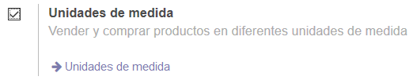
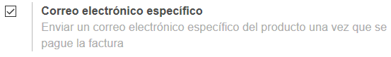
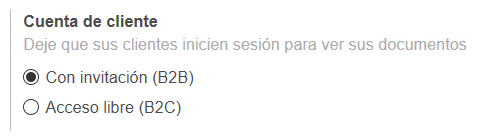
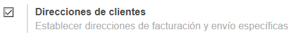
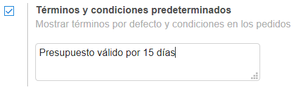
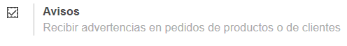
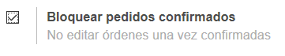
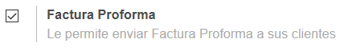
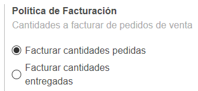

###################################################################################################
Otras caracteristicas
###################################################################################################

Si consultamos la opción de menú Configuración/Ajustes de la App de Ventas, 
podremos observar que Odoo nos permite activar (desactivar) algunas caracteristicas extras.

Vamos a ver algunos ejemplos:

*************************************************
Unidades de medida
*************************************************

link a compras

*************************************************
Correo electrónico específico
*************************************************

*************************************************
Cuenta de cliente
*************************************************

*************************************************
Direcciones de clientes
*************************************************

*************************************************
Términos y condiciones predeterminados
*************************************************

*************************************************
Avisos
*************************************************

*************************************************
Bloquear pedidos confirmados
*************************************************

*************************************************
Factura proforma
*************************************************

*************************************************
Política de facturación
*************************************************

